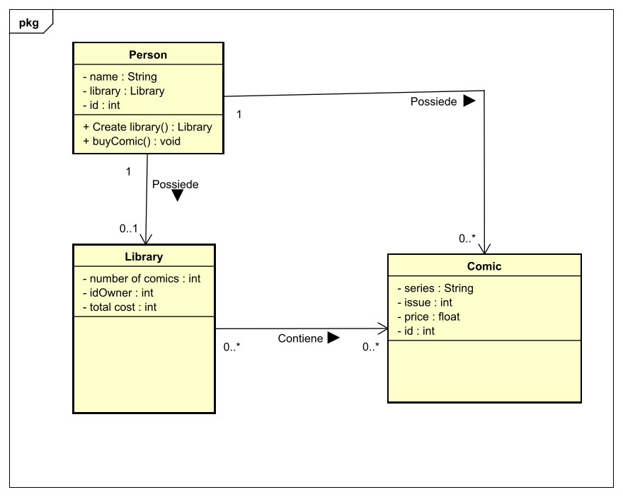

Cosa può fare **Comics library**?	

#Storie
1. Paolo si registra e gli viene assegnato un id
1. Paolo accede con l'id
1. Paolo crea una libreria, all'inizio vuota
1. Paolo aggiunge 'Spider-man 1' alla sua libreria
1. Paolo aggiunge 'Bat-man 4' alla sua libreria
1. Paolo rimuove 'Spider-man 1' dalla sua libreria

#Design 
